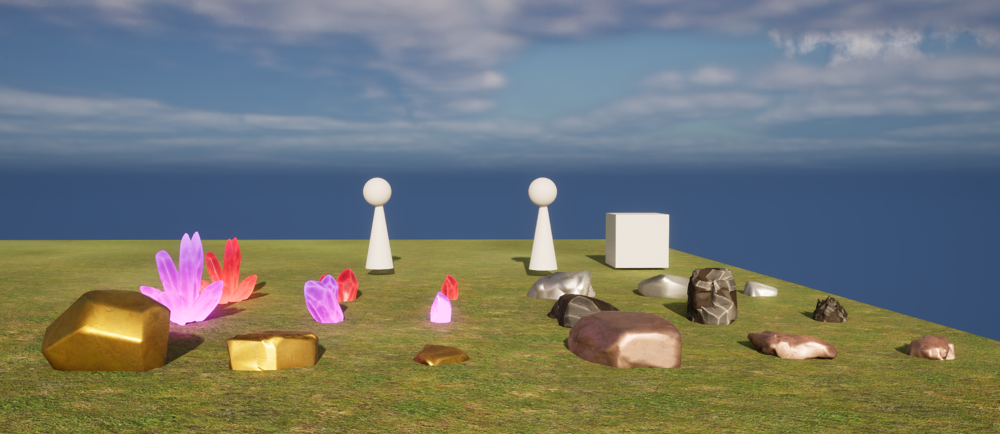
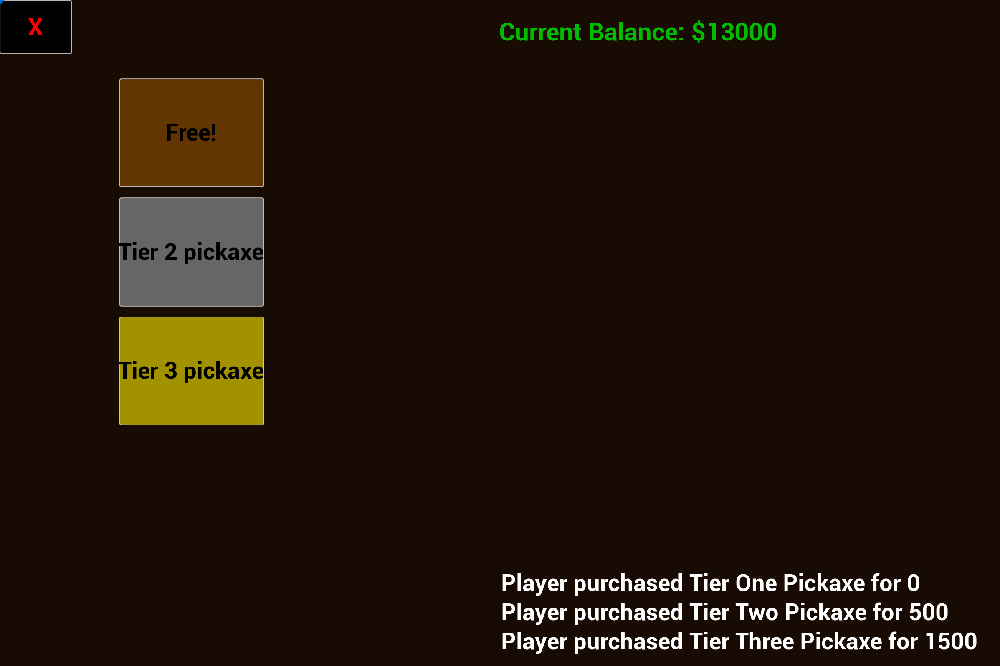
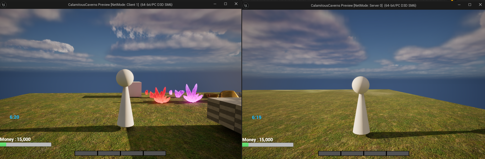

# Calamitous Caverns

**Senior Year Practicum Project | Unreal Engine 5.4.4**

Built in Unreal Engine 5.4.4 using Blueprints only, this project focuses on tech and tooling. I set up listen server multiplayer with the UE session system, used replicated actors and variables, and implemented RPCs for inventory updates, mining events, and quota changes. Level Streaming plus Seamless Travel manage cave sublevels to reduce memory. UI was built with UMG widgets for inventory, hotbar, shop, and quota, with GameState driving the day and night cycle and exposing time to clients.

---

### Features
- **Mining System**: Dynamic ore generation, pickaxe quality checks, and mining UI.  
- **Inventory & Economy**: Hotbar system, buy/sell shops, and receipts.  
- **Quota System**: Scaling formula tied to the day/night cycle.  
- **Day/Night Cycle**: Rotating sun with gameplay effects.  
- **Multiplayer**: UE5 listen server sessions, replication, and RPCs.  
- **Optimization**: Level streaming for seamless travel and reduced RAM usage.  

---

### Screenshots

  

  

  

---

### My Contributions
- Designed and programmed the **multiplayer session system** with RPCs and replication.  
- Built the **mining, inventory, and quota systems**.  
- Created the **main menu and session UI**.  
- Optimized performance using **level streaming** and efficient Blueprint structure. 
    

---

### Full Presentation
For a detailed overview with screenshots, blueprint captures, and demo videos: [Download](docs./CalamitousCavernsPresentation.pptx)

---

### Development
- **Engine**: Unreal Engine 5.4.4  
- **Language**: Unreal Engine Blueprints (visual scripting only)  
- **Tools**: Blender (low-poly assets), Photoshop/Illustrator (concept art)  

---

### My Contributions
- Designed and programmed the **multiplayer session system** with RPCs and replication.  
- Built the **mining, inventory, and quota systems**.  
- Created the **main menu and session UI**.  
- Optimized performance using **level streaming** and efficient Blueprint structure.  
- Documented the full project with a **game proposal** and **final practicum paper**.  

---
### Acknowledgments
I learned core UE networking concepts from **Cedric Neukirchen’s Multiplayer Network Compendium**. It helped me understand replication, RPC patterns, and session workflows, which I applied in this project.  
<https://cedric-neukirchen.net/docs/category/multiplayer-network-compendium/>
