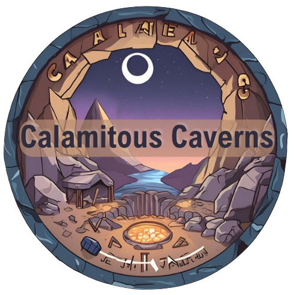

  

# Calamitous Caverns

**Senior Year Practicum Project | Unreal Engine 5.4.4**

**Calamitous Caverns** is a first-person Unreal Engine 5 game I designed and produced throughout my senior year of high school. Built in UE5.4.4, the project explores replication, session systems, level streaming, and core gameplay loops while delivering a playable multiplayer prototype.

---

## 🎮 Features
- **Mining System**: Dynamic ore generation, pickaxe quality checks, and mining UI.  
- **Inventory & Economy**: Hotbar system, buy/sell shops, and receipts.  
- **Quota System**: Scaling formula tied to the day/night cycle.  
- **Day/Night Cycle**: Rotating sun with gameplay effects.  
- **Multiplayer**: UE5 listen server sessions, replication, and RPCs.  
- **Optimization**: Level streaming for seamless travel and reduced RAM usage.  

---

## 🖼️ Screenshots

  

  

  

---

## 👤 My Contributions
- Designed and programmed the **multiplayer session system** with RPCs and replication.  
- Built the **mining, inventory, and quota systems**.  
- Created the **ma**
    

---

## Full Presentation
For a detailed overview with screenshots, blueprint captures, and demo videos, see [CalamitousCavernsPresentation.pptx](docs/CalamitousCavernsPresentation.pptx).

---

## Development
- **Engine**: Unreal Engine 5.4.4  
- **Language**: Unreal Engine Blueprints (visual scripting only)  
- **Tools**: Blender (low-poly assets), Photoshop/Illustrator (concept art)  

---

## My Contributions
- Designed and programmed the **multiplayer session system** with RPCs and replication.  
- Built the **mining, inventory, and quota systems**.  
- Created the **main menu and session UI**.  
- Optimized performance using **level streaming** and efficient Blueprint structure.  
- Documented the full project with a **game proposal** and **final practicum paper**.  

---

## Acknowledgments
I want to thank **Kekdot** on YouTube — his tutorials on Unreal Engine multiplayer concepts helped me understand replication and session systems, which I then applied to build my own implementation in Calamitous Caverns.
